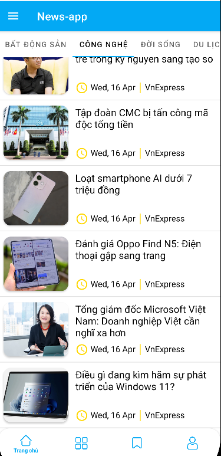
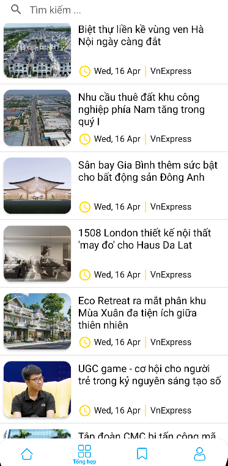
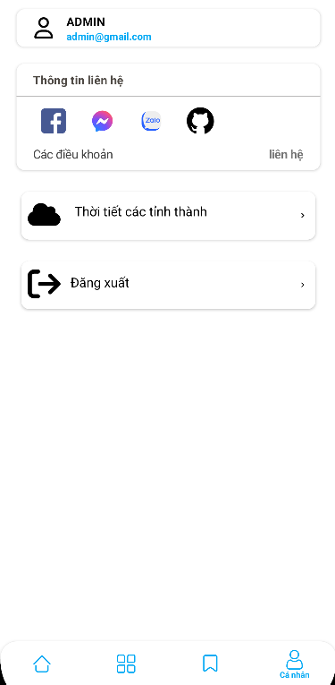
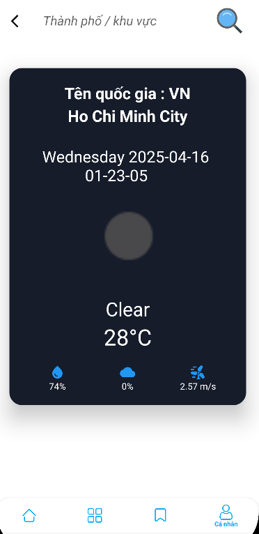
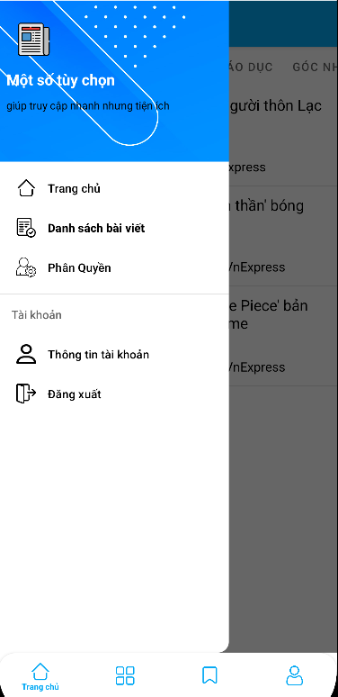

# 📰 News-App Mobile Kotlin

This is the Android mobile version of the **News App**, developed using Kotlin and modern Android tools. The app allows users to browse, search, and manage news content efficiently with a clean and user-friendly interface.

---

## Screenshots

|                        |                         |                         |                         |
|:----------------------:|:-----------------------:|:-----------------------:|:-----------------------:|
|  |   |   |   |
|  |   |   |   |

## 🏗️ The Complete Project Folder Structure

```text
app/
├── src/
│   ├── main/
│   │   ├── java/
│   │   │   ├── com.example.newsapp/
│   │   │   │   ├── data/
│   │   │   │   │   ├── local/                         # Local Data Sources
│   │   │   │   │   │   ├── datastore/                 # DataStore components
│   │   │   │   │   │   ├── entity/                    # Database entities (e.g., Room)
│   │   │   │   │   │   ├── service/                   # Local services
│   │   │   │   │   │   ├── LocalRepository.kt         # Local repo implementation
│   │   │   │   │   │   ├── NewsDao.kt                 # Room DAO
│   │   │   │   │   │   ├── NewsDatabase.kt            # Room Database
│   │   │   │   │   │   └── PreferenceRepository.kt    # Preferences manager
│   │   │   │   │   │
│   │   │   │   │   ├── remote/                         # Remote Data Sources
│   │   │   │   │   │   ├── request/                    # API request models
│   │   │   │   │   │   ├── response/                   # API response models
│   │   │   │   │   │   ├── service/                    # Retrofit services
│   │   │   │   │   │   ├── NetworkHelper.kt            # Network utilities
│   │   │   │   │   │   ├── NewsRepository.kt           # Remote news repo
│   │   │   │   │   │   └── WeatherRepository.kt        # Remote weather repo
│   │   │   │   │   │
│   │   │   │   │   └── di/                             # Dependency Injection configuration
│   │   │   │   ├────── ui/                             
│   │   │   │   │       ├── base/                       # Base classes for UI components
│   │   │   │   │       ├── main/                       # Main activity components
│   │   │   │   │       └── widget/                     # Custom UI widgets
│   │   │   │   │ 
│   │   │   │   ├───── utils/                           # Utility classes
│   │   │   │   └───── NewsApp.kt                       # Application class    
│   │   ├── res/                                        # Resources (layout, drawable, values, etc.)
│   └── test/                                           # Directory containing tests
└── build.gradle                                        # Gradle configuration file of the app
```
```text

```

## 🚀 Features

- 🗞️ **Browse News** – Read the latest articles from various sources
- 🔍 **Search News** – Filter articles by keyword
- 🌦️ **Weather Forecast** – Display simple weather info
- 📝 **Manage Articles** – Add, edit, and delete your own news post
- 🙍 **Edit Profile** – Manage user info
- 📚 **Reading History** – Track previously viewed articles
- 🧭 **Structured Navigation** – Smooth screen transitions with Navigation Component

## 🛠️ Tech Stack

- **Kotlin** – Main development language
- **MVVM** – Architectural pattern with ViewModel, Repository, LiveData
- **Retrofit + Gson** – API client and JSON parser
- **Hilt (Dagger)** – Dependency injection
- **Room Database** – Local data persistence
- **DataStore** – Store user preferences and auth tokens
- **Navigation Component** – Single-activity app structure
- **OkHttp** – Advanced networking with interceptors
- **Coroutines** – For async background operations
- **ViewModel + LiveData** – Lifecycle-aware state management
- **DataBinding** – Binding UI components to data
- **Material Design** – UI with Android Material Components

## 📐 Architecture

The application follows a **clean MVVM architecture** and is based on **single-activity design** using Jetpack’s Navigation Component. This ensures scalability, testability, and maintainability.

---

## 📦 Installation

```bash
git clone https://github.com/QDuyPhan/News-app.git
```

## 🌐 Backend API

```bash
git clone https://github.com/QDuyPhan/news-backendt
```
## 📄 License

This project is licensed under the [`MIT License`](LICENSE).

```text
MIT License
Copyright (c) 2025 Phan Quang Duy
```